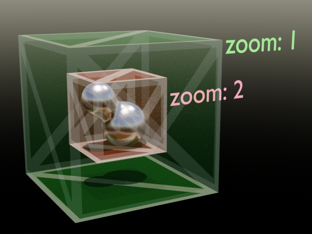
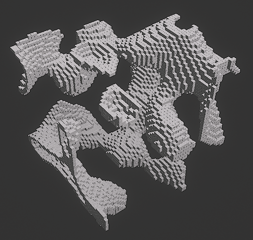

# Panzerball map coding tutorial
Created by Zelo101.

**This is for version 0, which as of 16/8/2020 is the current version of .ballmap maps.**

This will teach you how to code maps.

## What you need to know
- Basic Javascript

Ok, here we go!

## 1. Setup

For this, you'll need to have **node** installed, in order to run the JS scripts and install libraries.

Check that you have node installed with

`node --version`


**To keep things simple, please create a new directory for this.**

Now that node is installed, we now gotta init & install the needed libraries. To do this, run the following commands in the directory you just created.

```
npm init -y
npm i open-simplex-noise jsonfile
```

## 2. First steps

Now to the fun part!

Make a javascript file and add this:

```js
const noise = require("open-simplex-noise");
const jsonfile = require("jsonfile");
```

We'll need the noise constant to make the noise (obviously), and the jsonfile is so that we can easily turn our object into a json file, usable in the game.

Next, lets add the seed constant, this gives us completely different noise based on the number of the seed.

```js
const seed = 0;
```
This will give the noise function we need to generate the 3D noise.

Noisezoom zooms into the noise, basically. Here is a better explanation. 15 is a good number for noisezoom, too little makes tiny blobs, too much makes detailed, but uninteresting terrain.



```js
const noisemaker = noise.makeNoise3D(seed);
const noisezoom = 15;
```
We'll also need these variables, which will be explained later.

```js
let id = 1;
const blocksize = 400;
```

This is how big the generated noise should be.
`48x48x48` is playable, I consider `64x64x64` the max depending on the density.

```js
const xnoise = 48;
const ynoise = 48;
const znoise = 48;
```

These control when the blocks should be created, you'll find out what these do later on.

```js
const gdensity = .3;
const ldensity = .4;
```

## 3. Structure

This is the structure of a panzerball object **(as of version 0):**

Property | Type | Description
--- | --- | ---
name | *string* | Type of panzerball object
id | *number* | IDentifier
x | *number* | Position of the object in the x axis
y | *number* | Position of the object in the y axis
z | *number* | Position of the object in the z axis
pitch | *number* | Rotation of the object in the x axis
yaw | *number* | Rotation of the object in the y axis
roll | *number* | Rotation of the object in the z axis
mutation | *number* | Usually a change of size
modifier | *number* | Usually a change of colour

## 4. Creating panzerball objects

We will now create a function that creates objects.

...but before that, we need to create the object that will hold the array containing the objects. 

This will tell panzerball the structure version, along with the items that come with it.

```js
let map = {
    version: 0,
    items: []
}
```

This function will create the block object, and put in in the `map.items`

This will also give the object a unique id.

```js
function cloneBlock(name,x,y,z,pitch,yaw,roll,mutation,modifier) {
    let block = {};
    id+=1;
    block.name = name;
    block.id = id;
    block.x = x;
    block.y = y;
    block.z = z;
    block.pitch = pitch;
    block.yaw = yaw;
    block.roll = roll;
    block.mutation = mutation;
    blockclone.modifier = modifier;
    newjson.items.push(block);
}
```

Now lets get on with the really fun part, creating the map itself!

## 5. Creating the map!

Since this is a 3D game we will be using 3D noise, along with 3 nested for loops, one for each dimension. I'll explain this bit part by part.

This is the 3 nested for loops. Notice how `noisezoom` divides the constants.

```js
for (let x = 0; x < xnoise/noisezoom; x+=1/noisezoom) {
    for (let y = 0; y < ynoise/noisezoom; y+=1/noisezoom) {
        for (let z = 0; z < znoise/noisezoom; z+=1/noisezoom) {
```

This function returns the 3D Noise.

```js
let lenoise = noisemaker(x,y,z)
```
This if statement creates the block if `lenoise` is over 0.3 and under 0.4. 

```js
if (lenoise > gdensity && lenoise < ldensity) 
```

Now, here is where we finally create the block!

Let me brake this down.

**1. Enter the object's name.** We want to create a Block type.

**2. Input the location for the object.** We do this by:

`blocksize*x*noisezoom`, Calculating location for the block.

`.toFixed(1)`, Fix any floating-point errors x brings (thanks to noisezoom)

`Number()`, .toFixed returns a string, so we'll need to make it a number again.

```js
createBlock(
    "Block",
    Number((blocksize*x*noisezoom).toFixed(1)),
    Number((blocksize*z*noisezoom).toFixed(1)),
    Number((blocksize*y*noisezoom).toFixed(1)),
)
```

## 6. Output!

Now we will finally output the map to a json file, where we can now play it!

```js
jsonfile.writeFile('result.ballmap', newjson)
```

Optimally, we can also log the amount of blocks that were created. 

```js
console.log("Completed!\nBlocks created:",id)
```

Now lets run the script! Go into your command line again, *make sure your in the right directory*, and run
```
node (javascript filename) 
```

Our map file has now been created!

Copy `result.json`, and put it into this directory:

*C:\Users\\(username)\AppData\Local\Ball\Saved\Workshop\Maps*

And there we have it! If all goes well, you should get a map similar to this:



## 7. Closing notes

Obviously this isnt the most optimial way, for example, merging smaller cubes into a single big cube would help a lot with framerate.

If you are getting errors in this tutorial don't be afraid to send an github issue or contact me, at Zelo101#0138. Have fun!

